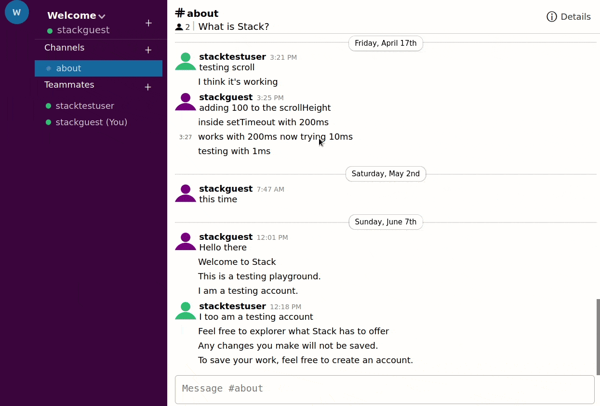

# Stack

This repo contains the back-end code for stack which is a miniature slack clone using Node/Express/TypeORM.

- Checkout the [TODO](TODO.md) for more information.
- client code is [here](https://github.com/ben-garcia/stack-client)

> React/Redux on the client and Node/Express/PostgreSQL API on the server.

## Features

- Create workspaces
- Create channels
- Add teammates to your workspaces
- Real time messaging using SocketIO
- Authentication and Authoriation via session cookie
- Caching using
- Data saved to a PostgreSQL database via Express API.
- Deployed to Heroku(server) and Netlify(client)

## Demo

**Prerequisites**

- [Node](https://nodejs.org)
- [PostgreSQL](https://www.postgresql.org/)
- [Redis](https://redis.io/)
- [Git](https://git-scm.com/)

## Install Locally

1. clone client repo with

   `git clone git@github.com:ben-garcia/stack-client.git client`

2. install client dependencies with

   `cd client` and `npm install` or `yarn`

3. clone server repo with
   `git clone git@github.com:ben-garcia/stack-server.git server`

4. install dependencies with
   `cd server` and `npm install` or `yarn`

5) start the server

   `npm run start`

   or

   `yarn start`

   which will start the server on port 8080.

6) start the client

   `npm run start`

   or

   `yarn start`

   which will start the client on port 3000.
