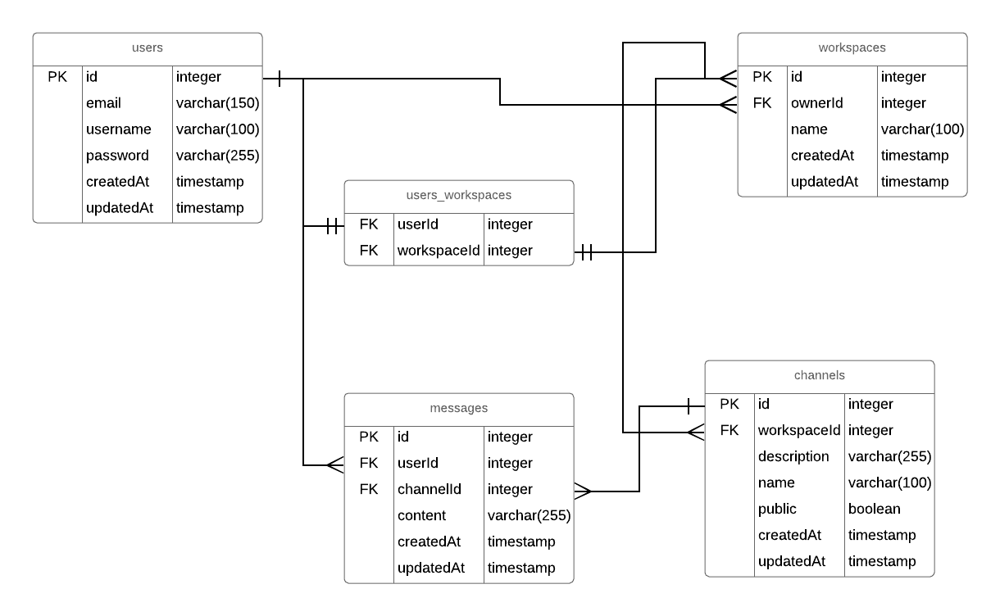

# TODO

- ## [x] Development Environment

  - [x] Typescript
    - [x] tsconfig.json
  - [x] ESLint
    - [x] airbnb style guide
  - [x] Prettier
    - [x] should play nice with ESLint
  - [x] Testing
    - [x] Jest
    - [x] Supertest
  - [x] Husky && lint-staging
    - [x] should pass testing and linting

- ## [ ] Setup

  - [x] Express

    - [x] ts-node
    - [x] nodemon
      - server restarts automatically after file changes.
    - [x] morgan
      - express logger
    - [x] helmet
      - helps to secure Express apps by setting various http headers.
    - [ ] express-session
      - authentication using session + cookie.
      - session store using redis/connect-redis for scalability.

  - [] TypeORM
    - [x] installation
    - [x] create User model
    - [x] create Workspace model
    - [x] create Channel model
    - [s] create Message model

- ## [ ] Models

  ### Entity Relationship Diagram

  

* ## [ ] Controllers

  - [ ] Authentication

    - [ ] /auth/register POST
      - endpoint to create a user and store in the db.
    - [ ] /auth/login POST
      - endpoint to search the db and return the user that matches username/password4
      - [ ] create the session

  - [ ] Workspaces

    - [ ] /workspaces POST
      - create a new Workspace
    - [ ] /workspaces/:id PUT
      - update a Workspace

  - [ ] Channels

    - [ ] /channels POST
      - create a channel
    - [ ] /channels PUT
      - edit a channel

  - [ ] Messages
    - [ ] /messages POST
      - create a new message
    - [ ] /messages/:id PUT
      - update a message
    - [ ] /messages/:id DELETE
      - delete a message
